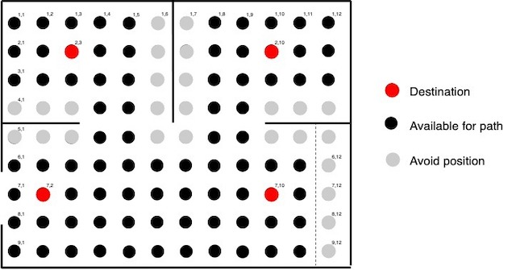

## Impaired Home Automation

Advanced Studio Project @ AIT

6201 Mohammed Tantawy - 6678 Davide Bragagnolo

### Robot - Wheelchair (with Indoor Navigation System and Smart Lights Control)

in order to run the robot, you must have:

- a RaspberryPI
- a robot with 2 dc motors, motor driver TB6612 and encoders
- Raspbian Stretch
- Python library for [SunFounder_TB6612](https://github.com/sunfounder/SunFounder_TB6612)
- The IHA IPS active [Details](https://github.com/imphomeauto/indoor-pos-system)
- The Smart Lights System active [Details](https://github.com/imphomeauto/smart_lights_esp8266_mcp23017)

start the robot `python robot.py`
the robot will take the position at the socket address `<ip_of_your_raspberry>:8000`

### Robot Details

The robot use the encoders to go straight and turn nearly-exactly to 90 degrees left or right. Depending on the type of floor/ground, could be necessary to adjust the encoders values and the motor speed.

### INS Details

The Indoor Navigation System (INS) is integrated in this robot script. The concept is: turn left/right if necessary, go ahead to destination coordinate x/y until IPS x/y is equal to destination.

The coordinates are mapped with the [Indoor Positioning System](https://github.com/imphomeauto/indoor-pos-system) part of the same project

#### INS Map

The preconfigured Map used for the demonstration, is the following:

- matrix area of 12 columns and 9 rows
- door at 4,4
- door at 8,4
- position entrance at 2,7
- position toilet at 3,2
- position bedroom at 10,2
- position kitchen at 10,7

